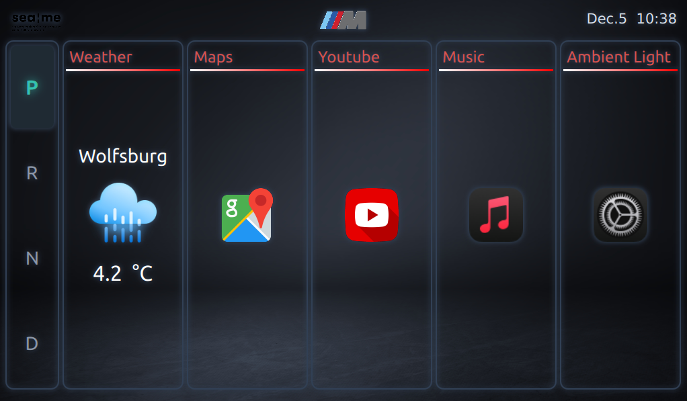
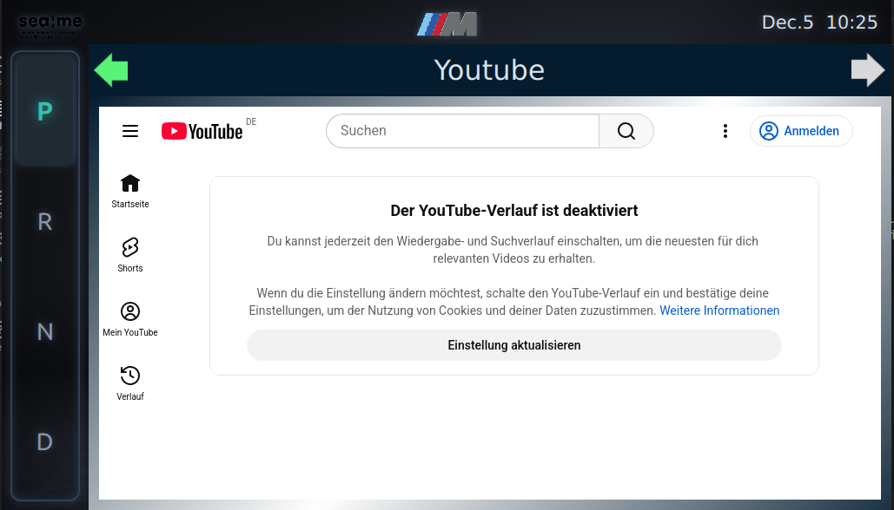
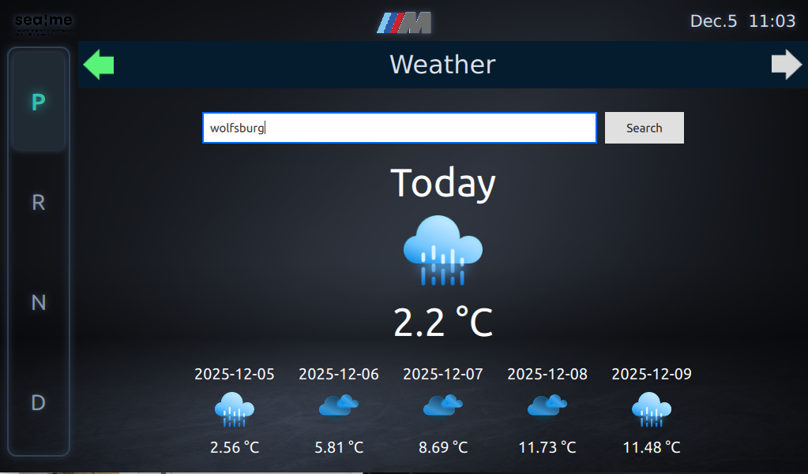
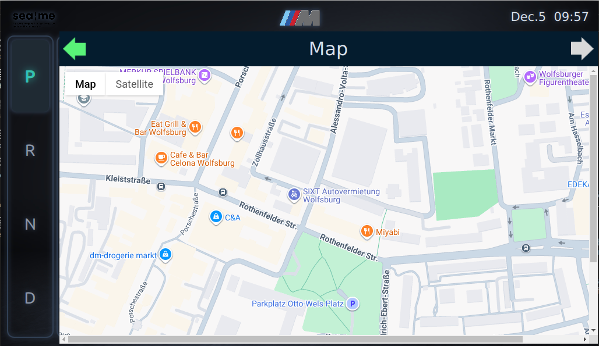

# SEA-ME-Head-Unit

## 1. Project Summary

SEA-ME Head Unit is a Qt/QML-based infotainment system.  
This repository integrates both the Head Unit application and the embedded Yocto build environment, enabling the system to run on embedded hardware such as the Raspberry Pi.

The project provides core in-vehicle infotainment features—including map display, media playback, weather information, USB content scanning, and image extraction—through a modular C++/QML architecture.

In this version, the previous **Instrument Cluster (IC)** project has been **rebuilt on a Yocto-based embedded Linux environment** and unified with the Head Unit system, allowing both components to share the same build pipeline and operate cohesively within the SEA-ME platform.

Overall, the goal of this project is to offer a unified development environment for building, testing, and deploying an automotive-grade Head Unit UI that can seamlessly integrate with the Instrument Cluster and vehicle data systems in the SEA-ME platform.

## 2. Architecture


## 3. Build & Installation
This system must be built on an Ubuntu 22 environment.
```bash
git clone https://github.com/JoeyGihoon/SEA-ME-Head-Unit.git
```

### 3.1 Common Setup

Before building images, configure your Wi-Fi settings in wpa_supplicant.conf-sane:

```
network={
    ssid="Your Wifi"
    psk="Your password"
    key_mgmt=Your Authentication
}
```

File location:
SEA-ME-Head-Unit/IC_team5/yocto/poky/meta/recipes-connectivity/wpa-supplicant/wpa-supplicant/wpa_supplicant.conf-sane

## 4. Function
<p align="center">
  
  
  
  
</p>


### 4.1 Overview

The SEA:ME Head Unit aims to provide a smooth, intuitive, and visually cohesive infotainment experience similar to commercial automotive systems.
It is developed to run on Yocto-based Linux with Qt/QML, supporting Ethernet communication with the Instrument Cluster (IC).

Below are the key UI screens included in the system:

### 4.2 Home Dashboard

The main dashboard provides quick access to all core applications:

- Gear setting
  
- Weather
  
- Maps

- YouTube

- Music

- Ambient Light settings

The UI is designed with a premium M-style theme and includes a gear indicator (P/R/N/D) synced with the Instrument Cluster via vehicle-side communication.

### YouTube Integration

The YouTube module embeds the YouTube web interface directly in the head unit, allowing users to browse and stream content through a clean, car-optimized layout.

### Real-Time Weather Forecast

The Weather module displays:

- Current temperature

- Weather conditions

- A 5-day forecast with dynamic icons

- Search capability for any city

Data is fetched online and updated directly from the API.


### Google Maps Navigation

The Maps module uses the Google Maps API to provide interactive navigation capability.
Users can pan, zoom, and switch between Map and Satellite views inside the Qt environment.

<video src="https://github.com/JoeyGihoon/HU-yocto-TEAM5/releases/tag/video/music.webm" width="45%" controls></video>
<video src="https://github.com/JoeyGihoon/HU-yocto-TEAM5/releases/tag/video/ambient_light.webm" width="45%" controls></video>

A lightweight and elegant music player designed for in-vehicle use.
It offers straightforward playback controls and a polished UI that integrates seamlessly with the head-unit environment.

### Ambient Light

A dynamic ambient-light controller that enables users to personalize interior lighting.
Includes smooth color transitions and an intuitive circular selector interface.

